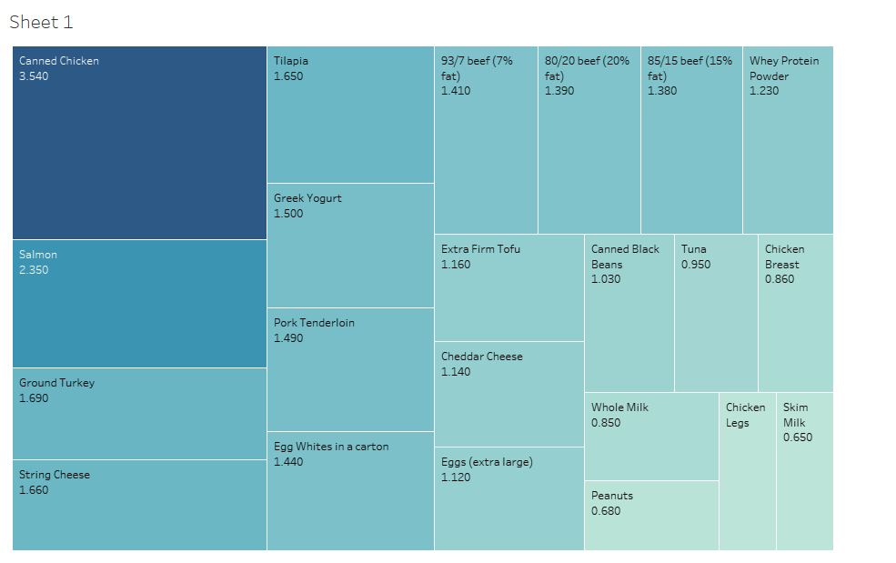
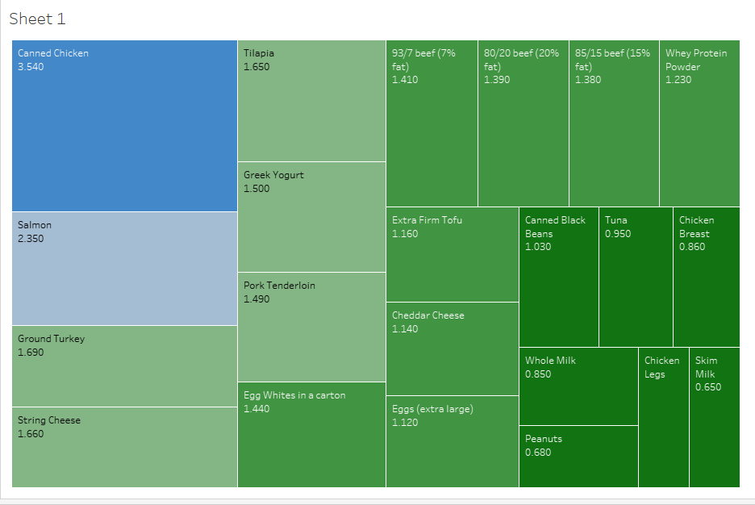

2023.11.15
## Assignment 3 & 4: Critique by Design with Tableau (MakeoverMonday)
### Step 1&2
[What Are The Cheapest High-Protein Foods?](https://www.thebodybuildingdietitians.com/blog/how-cost-effective-is-your-high-protein-diet)

[Screenshot](draft/PROTEIN+COST.png)

__Reason__:
First of all, I was intrigued by the topic of this data, which is very relevant and full of all kinds of foods. Secondly, the chart's title appealed to me because it contained the message 'low prices'. Once I saw the chart, I found it to be a concise and single bar chart with vertical information. Modifications could make it more interesting, but not so much that a cooking-loving but frugal grandmother would find it difficult to read.

__Observation__:
With prices skyrocketing, the topic of this chart is of high interest and very useful in everyday life. However, from a data comparison perspective, the population may compare in a more everyday unit, such as how much a meal or a day's recommended protein intake would cost or the maximum amount of protein consumed for the same price. Because of this, data comparison has yet to find the most efficient and intuitive entry point. I think it lacks a comparison with historical costs regarding information needed to understand. This topic exists on the premise that eggs are no longer the most cost-effective protein food, so the notion of difference can be better constructed by comparing it with historical egg costs. The calorie data in the chart is somewhat redundant; it has nothing to do with the y-axis, so the data can mislead the viewer and affect understanding. In terms of chart design, it uses the most straightforward and familiar bar chart and starts the Y-axis from 0, which significantly reduces the difficulty of understanding and, at the same time, ensures the truthfulness of the chart, choosing a pro-people way for the pro-people topic. However, its use of color is almost nil, as the group it is dealing with is people who care about eating healthy or fitness, so I tend to use color to differentiate between food groups such as meat, veggies and dairy products, which makes it easy to supplement the information they may need. Finally, this chart gives limited audience interaction and shows representative pictures of each thing to enhance the reader's attention and speed span in capturing information. But little is done to aid comprehension in the process. However, for mass readers of all ages, perhaps the simplicity of the reading is a plus.
### Step 3
 __Draft__:

__Interview__:
__- Can you tell me what you think this is?__

_Student, 23 : Price comparison chart for food._

_Adult, 52: Grids like a puzzle, with the grid area representing the high and low prices._

__- Can you describe to me what this is telling you?__

_Student, 23 : Canned chicken is so bad for the money, don't buy it. But the chicken legs are great. I can buy mainly the dark green part._

_Adult, 52: These two blue ones are too expensive, and this pile of dark green ones in the lower right corner could be considered a usual purchase. I didn't look closely at these in the middle._

__- Is there anything you find surprising or confusing?__

_Student, 23 : This form of table is rare. Is there a particular purpose for it? There are similar types of food in these, but the prices vary greatly, such as different chicken and fish. Substitutions can be considered later._

_Adult, 52: Why did you put them together? Is this blue-to-green ratio of any use? The green color takes up a large portion._

__- Are you more interested in knowing the price of the food for the same amount of protein or the amount of protein for the same price?__

_Student, 23 : The price._

_Adult, 52: The price._

__-Would you rather see a chart that offers interactivity like this sketch or a simple bar chart?__

_Student, 23 : I'll find it kinda funny when you tell me your intentions. But this should require a lot of text, and the graph is so square that text isn't very easy to add. A bar graph would suffice. And even with this 
 interaction, it's not really much of a reference._

_Adult, 52: I definitely think simple is better. Those words are so small I struggle to read them. And I don't see a chart like this often, so I can't react to it or read it in order. Besides, you can't actually put 
 them together in 20g combinations because the supermarkets sell them in pack sizes._

__-Does the color make it difficult for you to read, especially when it represents food?__

_Student, 23 : It's okay. The green color looks healthy. But there are several layers of green and just two of blue._

_Adult, 52: The color is too dark to see the words. Both are kind of cool-toned for food._

__- Is there anything you would change or do differently?__

_Student, 23 : If it's for that fun interactive science, I'll refine this to make sense; if it's a webzine or something, then it's still more intuitive to have a simple diagram, I guess._

_Adult, 52: Not very practical for people of our age. Or if you make the font a little bigger? This bunch of grids looks a little messy to me._

__Conclusion__：
My intention in choosing this chart was to invoke the concept of area. Because adults should consume around 60g of protein per day, and each grid represents 20g of protein, this equates to a combination of four grids to meet the day's protein requirements. In reality, it is also unlikely that we will eat only one type of protein, so we can choose a combination of foods from the dark green section to get the most cost-effective protein allotment. While the combination area represents the total price of the food, the audience can also get a certain level of guidance on replacing recipes under a similar area. However, from the actual feedback, it was concluded that such thinking logic requires explicit textual guidance, and the value of this reference is minimal, both in terms of the audience's subjective recipe choices and the minimum package size of the food. People still prefer a simple, efficient, and familiar mode of information extraction for everyday topics, which can complete basic understanding in less than ten seconds.
So, I decided to shift the direction of the modification back to bar charts and add some non-conflicting comparative information to the original. It doesn't affect people needing simple data but also enriches the chart.
### Step 4
__Before modification__：
After watching Viz Review video, I saw many novel ways of visualization and interactive techniques. Still, they seemed too fancy and complicated to understand in conveying the most basic and valuable information. Through the instructor's comments, bar charts are the most efficient and intuitive way to visualize, so I plan to follow the tutorial to create a fully functional bar chart.

<noscript></noscript><object class='tableauViz'  style='display:none;'><param name='host_url' value='https%3A%2F%2Fpublic.tableau.com%2F' /> <param name='embed_code_version' value='3' /> <param name='site_root' value='' /><param name='name' value='Book3_17001433954830&#47;Dashboard1' /><param name='tabs' value='no' /><param name='toolbar' value='yes' /><param name='static_image' value='https:&#47;&#47;public.tableau.com&#47;static&#47;images&#47;Bo&#47;Book3_17001433954830&#47;Dashboard1&#47;1.png' /> <param name='animate_transition' value='yes' /><param name='display_static_image' value='yes' /><param name='display_spinner' value='yes' /><param name='display_overlay' value='yes' /><param name='display_count' value='yes' /><param name='language' value='zh-CN' /><param name='filter' value='publish=yes' /></object>
                

[Watch me Viz](https://youtube.com/live/45pgu_SrZsg?feature=share)
